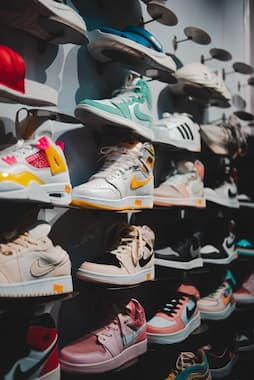

# Business Online Sports Revenue

## Project Overview

Sports clothing and athleisure attire represent a significant industry, valued at approximately $193 billion in 2021 with strong growth expected over the next decade! (https://www.statista.com/statistics/254489/total-revenue-of-the-global-sports-apparel-market/)
In this project, I will take on the role of a product analyst for an online sports clothing company. The company's main focus is on enhancing revenue. I will analyze product data, including pricing, reviews, descriptions, and ratings, as well as revenue and website traffic, to generate recommendations for the marketing and sales teams.
